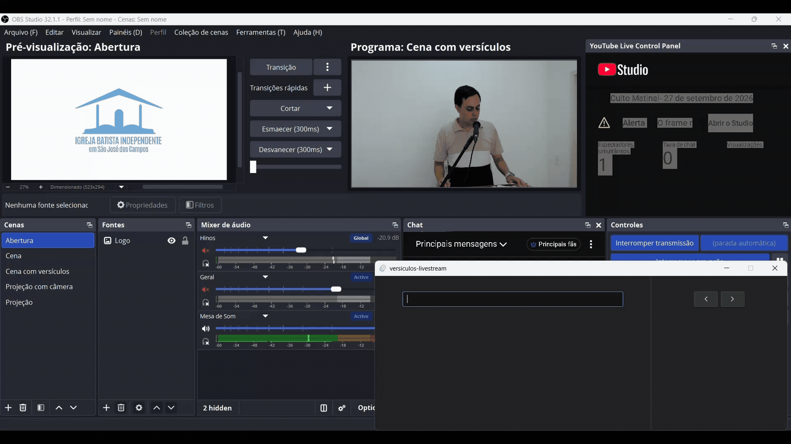
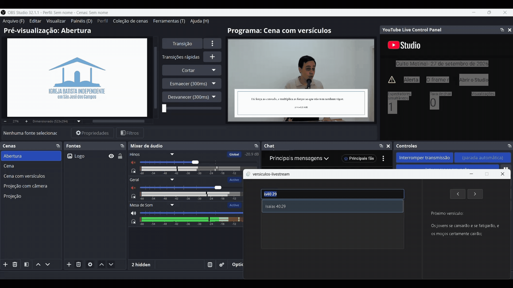

# Verso

Aplicação desktop para exibir versículos bíblicos em transmissões ao vivo (livestreams). Pensada para acompanhar a leitura durante uma pregação: o operador pesquisa o versículo, navega entre os versículos vizinhos conforme o pregador avança e controla quando o texto aparece ou some da tela.

O app é composto por duas janelas:

- **Janela de controle**: a janela principal, onde o operador pesquisa, navega e vê a prévia do que vem a seguir.
- **Janela de legenda**: uma janela transparente e sem bordas, pensada para ser capturada pelo software de transmissão (OBS, vMix etc.) e exibir o versículo sobre o vídeo.

A janela de legenda abre junto com o programa, é recriada automaticamente caso seja fechada e fecha quando a janela de controle é encerrada.

## Funcionalidades

### Pesquisa de versículos

Digite a referência no campo de busca e uma lista de resultados aparece abaixo do campo. A pesquisa foi pensada para ser dinâmica e ágil, permitindo tanto a digitação da referência no formato tradicional quanto formas abreviadas, facilitando a busca durante uma leitura ou pregação.

Por exemplo, referências podem ser pesquisadas normalmente:

- `1 Samuel 15:22`
- `Efésios 2:8`

Mas também é possível utilizar formas mais rápidas e compactas:

- `1co13 1` → 1 Coríntios 13:1
- `gn1 1` → Gênesis 1:1

Use `↑` e `↓` para escolher um resultado (ou clique nele) e `Enter` para exibi-lo na legenda. A prévia do versículo selecionado é mostrada na janela de controle antes de ir ao ar.



### Navegação entre versículos vizinhos

Com um versículo em exibição, use `←` e `→` (ou os botões da interface) para ir ao versículo anterior ou ao próximo. A janela de controle mostra o texto do próximo versículo, o que ajuda a se preparar enquanto o pregador lê.

### Pausa na exibição

Pressione `Esc` para retirar o versículo da tela. A legenda some com uma transição suave, e o último versículo exibido fica guardado, com o endereço preenchido no campo de busca.



### Navegação pausada

Enquanto a exibição está pausada, as setas `←` e `→` navegam a partir do último versículo exibido, sem colocar nada na tela. O campo de busca acompanha o endereço do versículo atual, e a janela de controle mostra a prévia do versículo escolhido. Ao pressionar `Enter`, o versículo é exibido novamente na legenda. Digitar algo no campo de busca sai do modo pausado e volta à pesquisa normal.

### Histórico

Os versículos já exibidos são registrados em um histórico, que é usado pela pesquisa para auxiliar nas buscas seguintes.

## Atalhos

| Tecla | Ação |
| --- | --- |
| `Enter` | Exibe o versículo selecionado na legenda |
| `↑` / `↓` | Seleciona outro resultado da pesquisa |
| `←` / `→` | Vai ao versículo anterior / próximo (na exibição ou na pausa) |
| `Esc` | Pausa a exibição e mantém o último versículo para navegação |

## Tecnologias

- [Tauri](https://tauri.app/) (aplicação desktop)
- React + TypeScript
- Texto bíblico: Almeida Corrigida Fiel (ACF), carregado de um arquivo JSON local

## Como executar

Pré-requisitos: [Node.js](https://nodejs.org/), [Rust](https://www.rust-lang.org/tools/install) e as [dependências do Tauri](https://tauri.app/start/prerequisites/) para o seu sistema operacional.

```bash
# instalar as dependências
npm install

# executar em modo de desenvolvimento
npm run tauri dev

# gerar o instalador
npm run tauri build
```

## Uso em transmissões

1. Abra o aplicativo. A janela de legenda abre automaticamente.
2. No software de transmissão, adicione uma captura de janela apontando para a janela de legenda (título "Exibição de versículo").
3. Use a janela de controle para pesquisar e exibir os versículos durante a pregação.